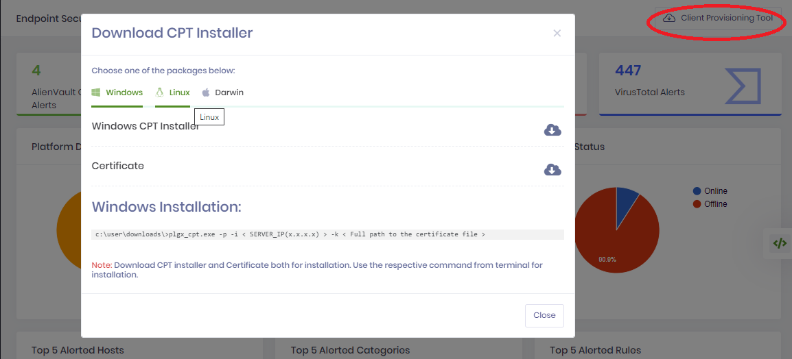
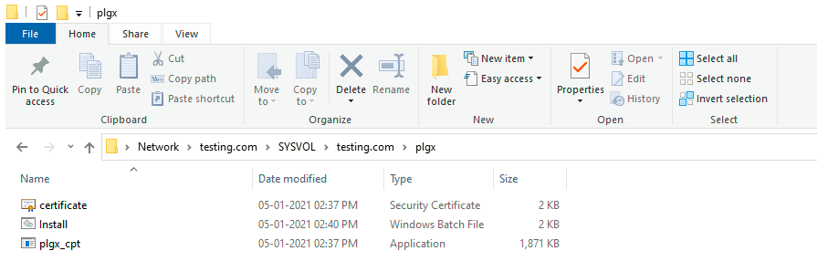
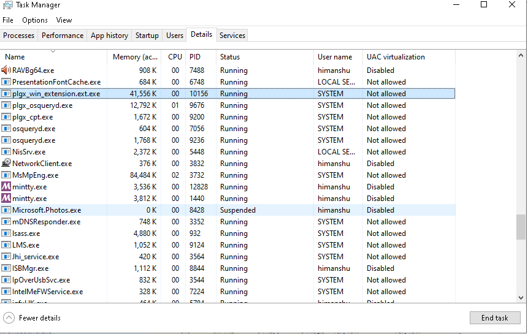

Provisioning the PolyLogyx Client for Endpoints
================================================

The PolyLogyx client that is a part of the PolyLogyx endpoint platform,
leverages osquery, a multi-platform operating system monitoring and
instrumentation framework. Here are the features the PolyLogyx client offers:

-   Compliance (PCI, HIPAA)

-   Digital forensics

-   Asset and inventory use cases

-   Vulnerability management

-   Host intrusion detection

-   Performance and operational troubleshooting

Typically, deploying osquery and running it across your fleet can be a daunting and complicated task, because of its large configuration surface and option.  To simplify the deployment of PolyLogyx osquery based agent, the platform is shipped with a Client Provisioning Tool (CPT) that wraps all the necessary configuration and makes the client provisioning process extremely simplified. 

This chapter includes these topics:

-   [Installing the PolyLogyx Client](#installing-the-polylogyx-client)

-   [Uninstalling Client](#uninstalling-the-client)

-   [Upgrading the Client](#upgrading-the-client)

-   [Troubleshooting Client Installation
    Issues](#troubleshooting-client-installation-issues)

Installing the PolyLogyx Client 
--------------------------------

Installing the PolyLogyx client involves these steps:

1.  Complete the needed prerequisites. See [Before you
    Begin](#before-you-begin-1) for more information.

2.  Deploy the client. See [Deploying the PolyLogyx
    Client](#deploying-the-polylogyx-client) for more information.

3.  Verify if the installation was successful. See [Verifying Client
    Installation](#verifying-client-installation) for more information.

### Before you Begin

Before you begin installation, ensure you complete the following prerequisites.

-   Procure the needed software by requesting the access from the [PolyLogyx
    site](https://polylogyx.com/downloads).

-   Provision a PolyLogyx server using a docker image. For more information, see
    [Provisioning the PolyLogyx Server](#getting-started).

-   Ensure you have working knowledge of osquery. If not, please read about
    [osquery](https://osquery.io/).

-   Make sure the endpoints meet the following system requirements.

    -   Support 64-bit architecture on Windows 7 and above, Linux and MacOS

		-   For Windows 7 or later operating system installed as specified [here](https://github.com/polylogyx/osq-ext-bin)

	-   Support 32-bit architecture on Windows platforms only (Windows 7 and above)
	
    -   Do not have these installed:

        -   PolyLogyx Extension version older than 1.0.35.15 on Windows
		-   Osquery agent on Linux/MacOS

    -   Do not have host-based firewalls or other security tools that might
        interfere with a remote installation

    -   Allow outbound TCP traffic on port 9000


### PolyLogyx Client Provisioning Tool (CPT)

To simplify the provisioning of the endpoints with osquery agent and PolyLogyx Extension (as applicable), 
PolyLogyx ESP provides a simplified tool known as CPT. The CPT for individual operating system could be
downloaded from the web interface of the PolyLogyx ESP.



The following sections provide details on deploying the agent using CPT on different platforms.

	
### Deploying the PolyLogyx Client on Windows

Use the PolyLogyx Client Provisioning Tool (CPT) utility to deploy the PolyLogyx
client on endpoints. After you identify endpoints on which to deploy the client,
push the CPT utility and public key file to the endpoints using any standard
mechanism, such as SCCM.

Initiate a remote session and run the installation command remotely (using
PSEXEC or WMIC command line utilities) with administrative privileges.

Here is the syntax to execute the installation command.

``` plgx_cpt.exe -p -i <ip address> | -h <hostname> -k <server's public key file> [-o <download directory>] [-y <yara refresh interval>]```

Here is the syntax description.

| Parameter | Description                                                                                                                                                                                  |
|-----------|----------------------------------------------------------------------------------------------------------------------------------------------------------------------------------------------|
| \-p       | Signifies the option for provisioning the client                                                                                                                          |
| \-i or -h | Specify one of the following. This is a required parameter. -i represents the IP address of the PolyLogyx management server (x.x.x.x format). -h represents the fully qualified domain name to the management server in the format a.b.c. You don’t need to https.                                                                                                                              |
| \-k       | Indicates the full path to the server public key file. This is a required parameter.                                                                                                         |
| \-o       | Indicates the location at which to download. The default value is c:\\plgx-temp\\. This is an optional parameter.                                                                            |
| \-y       | Indicates the yara refresh interval in seconds for downloading signature files from server.                                                                            |

Here is an example of a remote command execution using PSEXEC.

``` psexec \\101.101.1.101 -u Administrator cmd /c dir C:\Users\Administrator\plgx_cpt.exe -p -i 11.111.111.11 -k c:\certificate.crt```

The installation begins and the CPT utility brings the required artefacts on the
endpoints. After installation is complete, the Polylogyx Osqueryd service and PolyLogyx
extension are deployed and the osqueryd service starts. Also, PolyLogyx Agent is installed as a Windows service and it acts as a watcher for osqueryd service. If the osqueryd service stops, the PolyLogyx Agent service restarts it. The following output is
displayed if the command is successful.

```
########### Installation operation started ###########
Downloading files...Done
Installing files...Done
Verifying PolyLogyx Endpoint Platform services are up and running....
PolyLogyx Endpoint Platform services initialized.
########### Installation operation completed successfully ###########
```
### Deploying the PolyLogyx CPT on Windows by GPO

Group Policy Object (GPO) deployment involves created 'scheduled task' that will periodically connect to a network folder location and run Install.bat to install PolyLogyx CPT.

Using Microsoft Group Policy to deploy PolyLogyx CPT requires two main things:
- A shared location to store executables and certificate.
- A Group Policy Object (GPO) to create a scheduled task.

#### Folder Layout
A centralised network folder accessible by all machines that are going to be running PolyLogyx CPT is needed. We suggest inside the sysvol directory as a suitable place since this is configured by default to have very restricted write permissions. It is important that the folder contents cannot be modified by users, hence recommending Sysvol folder!

You will need to download the below files and copy them to an appropriate location such as sysvol located at ``\\%YourDomainName%\sysvol\%YourDomainName%\plgx``

- plgx_cpt.exe - From PolyLogyx ESP Server 
- certificate.crt - From PolyLogyx ESP Server
- Install.bat - From [here](../files/GPO%20Deployment/Install.bat) & update the file with PolyLogyx ESP Server IP address

Looking in the sysvol folder you should now be able to see similar to below.


#### Scheduled task GPO Policy
This section sets up a scheduled task to run Install.bat (stored on a network folder), distributed through Group Policy.

Import the [plgx-Task](../files/GPO%20Deployment/plgx_gpo.zip) GPO into group policy management and link the object to a test Organisational Unit (OU). Once the GPO is confirmed as working in your environment then you can link the GPO to a larger OU to deploy CPT further.

  1. Open up group policy management editor
  2. Edit the plgx-Task GPO
  3. Change the setting for the batch file network location by navigating to: ``Computer Configuration\Preferences\Control Panel Settings\Scheduled Tasks\plgx-Task\Actions`` and then select ``"Start a program" > Edit > Change the Location.``
  
For example \\\testing.com\SYSVOL\testing.com\plgx\Install.bat

### Verifying Client Installation 

After you deploy the PolyLogyx client, complete these steps to verify the
installation. When the PolyLogyx client is installed successfully, the following
processes/services start:

1.  plgx_osqueryd service

2.  vast service

3.  vastnw service

4.  Plgx_win_extension.ext.exe process

Incase of GPO deployment, ``C:\Program Files\plgx_osquery\runningver.txt`` file will have the status of above services.

Installation is not successful if any of these fail to start.

Follow these steps to check if the required processes are running.

1.  Open a command window with administrative privileges.

2.  Switch to "c:\Program Files\plgx_osquery" folder in command prompt.

3.  Run the following command to check the state of software stack, including
    osquery, PolyLogyx Extension and associated services.

```plgx_cpt.exe –c```

The command output lists the current state of the osqueryd, vast, and vastnw
services.

```Service vast up and running.
Service vastnw up and running.
Service plgx_osqueryd up and running.
============== Query Execution Output ==============
name : plgx_win_extension
path : \\.\pipe\plgx_osquery.em.10020
sdk_version : 0.0.0
type : extension
uuid : 10020
version : 1.0.40
============== Query Execution Finished ==============
Service plgx_cpt up and running.  
```

1.  Review the output to verify if the required services are running.

2.  Check if the plgx_win_extension.exe process is running.

3.  Open Task Manager.

4.  Switch to the Details tab.

5.  Locate the entry for the plgx_win_extension.exe process.

6.  Verify that process status is set to Running.

    

Uninstalling the Client
-----------------------

Follow these steps to uninstall the PolyLogyx client.

1.  Open a command window with administrative privileges.

2.  Close any open instances of the osqueryd, vast, and vastnw services.

3.  Close installation directory "c:\Program Files\plgx_osquery" if opened in Explorer view or command prompt.

4.  Close Event Viewer. 

5.  In command prompt, go to the folder (Note: This is not the installation directory) where CPT tool was downloaded for provisioning client.

    Run the uninstall command.

    Here is the syntax to execute the uninstallation command.

```plgx_cpt -u <d / s>```

The -u parameter is used to uninstall the agent and cannot be combined with any
other options. With the –u option, you must use one of these options:

| Option | Description                                                                                                                           |
|--------|---------------------------------------------------------------------------------------------------------------------------------------|
| s    | Used with the –u parameter for shallow uninstall. This option only uninstalls the software and does not delete associated data files. |
| d    | Used with the –u parameter for deep uninstall. This option removes all traces of the agent, including data files.                     |

Here are command examples.

The following output is displayed if the `plgx_cpt.exe -u d` command is successful.

```
########### Deep uninstall started ###########
Stopping Polylogyx Endpoint Platform services...Done
Deleting Install directory...Done
Deleting other files...Done
########### Deep uninstall completed successfully ###########
```   

The following output is displayed if the `plgx_cpt.exe -u s` command is successful.

```
########### Shallow uninstall started ###########
Stopping Polylogyx Endpoint Platform services...Done
Cleaning installed files...Done
Deleting other files...Done
########### Shallow uninstall completed successfully ###########
```                                                                                                                                                                                                                                                                              

Upgrading the Client 
---------------------

Follow these steps to upgrade the PolyLogyx client.

1.  Open a command window with administrative privileges.

2.  In command prompt, go to the folder (Note: This is not the installation directory) where CPT tool was downloaded for provisioning client.

3.  Run the upgrade command.

    Here is the syntax to execute the upgrade command.

```plgx_cpt.exe -g <d / s>```

The -g parameter is used to upgrade the agent and cannot be combined with any
other options. With the –g option, you must use one of these options:

| Parameter | Description                                                                                                                                                                                  |
|-----------|----------------------------------------------------------------------------------------------------------------------------------------------------------------------------------------------|
| d         | This will completely replace agent and old data files and bring the system to a new-installation state.                                                                                      |
| s         | This will only upgrade software and not delete any data files.                                                                                                                               |

The following output is displayed if the `plgx_cpt.exe -g d` command is successful. 

```
########### Upgrade started ###########
########### Deep uninstall started ###########
Stopping Polylogyx Endpoint Platform services...Done
Deleting Install directory...Done
Deleting other files...Done
########### Deep uninstall completed successfully ###########
########### Installation operation started ###########
Downloading files...Done
Installing files...Done
Verifying PolyLogyx Endpoint Platform services are up and running....
PolyLogyx Endpoint Platform services initialized.
########### Installation operation completed successfully ###########
########### Upgrade completed successfully ###########
```

The following output is displayed if the `plgx_cpt.exe -g s` command is successful.

```
########### Upgrade started ###########
########### Shallow uninstall started ###########
Stopping Polylogyx Endpoint Platform services...Done
Cleaning installed files...Done
Deleting other files...Done
########### Shallow uninstall completed successfully ###########
########### Installation operation started ###########
Downloading files...Done
Installing files...Done
Verifying PolyLogyx Endpoint Platform services are up and running....
PolyLogyx Endpoint Platform services initialized.
########### Installation operation completed successfully ###########
########### Upgrade completed successfully ###########
```

### Deploying the PolyLogyx Client on Linux

Use the PolyLogyx Client Provisioning Tool (CPT) binary to deploy the PolyLogyx
client on endpoints. The following command can be invoked to deploy the client.

sudo  ./plgx_cpt -p -i < SERVER_IP(x.x.x.x) > -k < Full path to the certificate file >

**NOTE**: Execution permission is required before executing the above command.

### Deploying the PolyLogyx Client on MacOS

Use the PolyLogyx Client Provisioning Tool (CPT) shell script to deploy the PolyLogyx
client on endpoints. The following command can be invoked to deploy the client.

sudo bash plgx_cpt.sh -p -i < SERVER_IP(x.x.x.x) >


Troubleshooting Client Installation Issues
------------------------------------------

This section examines the common errors and their resolution.

To resolve general osquery-related issues, review their [slack
channel](https://osquery-slack.herokuapp.com/).

### Incorrect server details

When you run a command with incorrect server details, such as invalid host name, 
the UI shows message below and will redirect to a log file path.

```No such host is known.```

See log file for following error details.

```Error: (11001)(No such host is known.)```

**Resolution**: To resolve this issue, execute the command with correct server details.

### Incorrect IP format

When you run a command with incorrect server details, such as invalid IP, 
the UI shows message below and will redirect to a log file path.

``` Invalid IP Address: <IP>```

See log file for following error details.

``` Invalid IP Address: <IP>```

**Resolution**: To resolve this issue, execute the command with correct IP format.


### Incorrect IP address

When you run a command with incorrect server details, such as unreachable IP, 
the UI shows message below and will redirect to a log file path.

```Downloadng files from server failed.```

See log file for following error details.

```
Transfer failed for [c:\plgx-temp\plgx_osqueryd.exe] , Error Code: (7)(Couldn't connect to server).
Downloadng files from Server failed.
```

**Resolution**: To resolve this issue, execute the command with correct IP address.

### Insufficient privileges

The following error message is displayed when you run a command without
administrative privileges or sufficient arguments.

```Insufficient privileges. Need Adimistrator privileges to run the tool.```

**Resolution**: To resolve this issue, execute the command with administrative
privileges and sufficient arguments.

### Incorrect certificate file name or path

If you execute the command to install the PolyLogyx client with an incorrect
certificate path, the UI show message below and will redirect to a log file path.

```Failed to read server's public key from input file: <cert_path>```

See log file for following error details.

```Error occured in reading PubKey cert. Error: (2)(The system cannot find the file specified.```

**Resolution**: To resolve this error, execute the command with the correct path.

### Invalid certificate

If you execute the command to install the PolyLogyx client with administrative
privileges but with an invalid certificate, the UI show message below and will redirect to a log file path.

``` Downloadng files from server failed.```

See log file for following error details.

```Downloadng files from Server failed. Error (60)(Peer certificate cannot be authenticated with given CA certificates).```

**Resolution**: To resolve this error, execute the command with a valid certificate.

### Failed to configure Osquery

If you try to install the PolyLogyx client when osquery already installed, the
following error message is displayed.

```
Polylogyx Agent is already installed, please uninstall before proceeding.
Use plgx_cpt -u <d / s> option for uninstall.
Refer help for options, or, log file C:\plgx-temp\plgx_cpt.log.<hostname>.<date_timestamp> 
for error details.
```

**Resolution**: Follow these steps to resolve the issue:

1.  If osquery is already installed, use tool with -u option to uninstall
    osquery. For more information, see [Uninstalling the
    Client](#uninstalling-the-client).

2.  Execute the command to install the PolyLogyx client with administrative
    rights and a valid certificate. For more information, see [Deploying the
    PolyLogyx Client](#deploying-the-polylogyx-client).

	
|										|																							|
|:---									|													   								    ---:|
|[Previous << Provisioning the PolyLogyx Server](../02_Provisioning_Polylogyx_Server/Readme.md)  | [Next >> Configuring the server](../04_PolyLogyx_Server_Configurations/Readme.md)|
