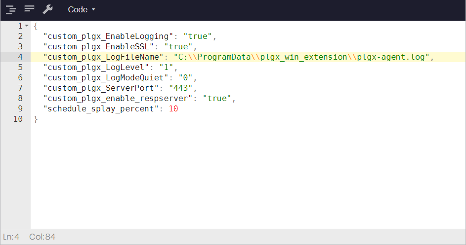

Configuring the PolyLogyx Client
================================================

After the PolyLogyx client is provisioned, the default and seeded configuration comes into play. If needed, you can customize the various configuration settings defined for the PolyLogyx client. The documentation covered in this chapter assumes Windows x64 and Linux as the client operating system.

To customize the configuration settings, you can modify the following:

1. osquery.flags file 
2. Predefined filters and queries
3. PolyLogyx configuration options

The osquery.flags File
--------------------------------
The osquery.flags file includes all the parameters needed for osquery initialization and functioning. By default, this file is stored in the <i>C:\Program Files\plgx_osquery</i> folder. 

Although this file contains all the flags supported by osquery, in this section, we will discuss only the key flags that are relevant for the PolyLogyx platform. 

Update the parameters to configure the deployment environment to meet your specific needs. Note that modifying these values may significantly alter the performance of the endpoint agent. These configured values are passed to the endpoint agent during the [client provisioning](https://github.com/polylogyx/platform-docs/03_Provisioning_Polylogyx_Client#provisioning-the-polylogyx-client-for-endpoints) through the osquery.flags file.

| Flag | Description                                                                                                                                                                                 |
|-----------|----------------------------------------------------------------------------------------------------------------------------------------------------------------------------------------------|
| extensions_autoload=C:\Program Files\plgx_osquery\extensions.load | Informs the osquery agent to load an extension during osquery initialization. The extensions.load contains the location to the PolyLogyx Extension file. We recommended that you DO NOT change this flag.                                                                                                                                  |
| extensions_interval=10   extensions_timeout=90   extensions_require=plgx_win_extension   allow_unsafe | Control the extension loading behavior of the osquery agent. We recommended that you DO NOT change this flag. |
| disable_watchdog=true   watchdog_level=-1 | PolyLogyx Extension is a real-time event monitor on the endpoint. Real time monitoring can be voluminous and query paths to the tables where those events are recorded could surpass the default performance constraints imposed by osquery on its child processes and threads. It is therefore recommended to turn off those constraints for better stability.|
| events_max=1500   events_expiry=3600 | Manage the history of real time events recorded on the endpoint. By default, up to 2500 events are recorded and when the count is hit, all the events that are older than 3600 seconds are purged from the local database. Altering these values can cause performance impact on queries. | 
| config_tls_refresh=300 | Controls the refresh interval for agent configuration. Any changes to the agent configuration (as defined below) will get picked by the agent after this interval.|

Predefined filters and queries
---------------
As soon as an agent checks-in with the server, a default configuration is applied to the agent based on the operating system of the endpoint. The configuration contains the list of scheduled queries and filters that are applied on the agent.

For the Windows operating system, PolyLogyx Extension is part of the agent and therefore the configuration includes the following:
    a. Additional filtering criteria to eliminate <i>white noise</i> from the real-time telemetry. 
    b. Set of scheduled queries that captures all the process creation and network connections data from the endpoint. 
    The configurations are editable and the changes in the configuration are picked up by the endpoint based on the <i>config_tls_refresh</i> value in the osquery.flags file.

For Windows x64 systems, PolyLogyx ESP is shipped with 2 types of pre-baked configurations, called as "Deep" and "Shallow". Deep is representative of a configuration designed for more aggressive data collection from endpoints than Shallow. Each configuration provides a default set of scheduled queries and filters and at any point only on of them is "active". The "active" one is also highlighted by the green dot and the other with a red dot.

For more informtaion on scheduled queries, see  [Scheduled Queries](https://github.com/polylogyx/platform-docs/06_Queries_and_packs#scheduled-queries). 
    
Perform these steps to view or edit defined filters:
1. Access the web interface for the server.
2. Navigate to CONFIG MANAGEMENT  > Config.

   

   The page lists the predefined queries available for Windows, Linux, and Apple.  
3. Select an operating system, such as Windows.

   

4. Click the tab for Shallow or Deep, if the agent is running on a Window x64 system.

5. Scroll down to view the Additional Config and Filters pane. 
6. Select the Tree view to review the predefined values and filters. 
   
7. Optionally, switch to the Code view to edit or define new filters, as needed.      
 
   For more information on filters, review the  [Understanding Filters](https://github.com/polylogyx/platform-docs/05_Understanding_Filters) section.

8. Click Update to save your changes. 

PolyLogyx configuration options
---------------------
The PolyLogyx configuration options are global in nature and are applied to all agents in addition to the agent configurations. The PolyLogyx platform provides the feature of 'response action' thru the same osquery extension that is used to collect endpoint telemetry. The response action can be controlled via these configuration options alongwith other osquery options.

GLOBAL for all nodes vs Custom config for selected nodes

Perform these steps to view or edit this configuration:
1. Access the web interface for the server.
2. Navigate to CONFIG MANAGEMENT > Options.

   

3. Review the listed options. 

   

4. Edit the option values, as needed, and click <b>update option</b>.
   Here are the options descriptions. 

| Option | Description                                                                                                                                                                                         |
|-----------|----------------------------------------------------------------------------------------------------------------------------------------------------------------------------------------------|
| custom_plgx_EnableLogging | Specifies whether to enable logging for the PolyLogyx Response Action on client. By default, set to true.   | 
| custom_plgx_EnableSSL | Specifies whether to enable or disable SSL cert events. By default, set to true.   | 
| custom_plgx_LogFileName | Specifies the name and location of the log file.   |
| custom_plgx_LogLevel | Indicates the logging level for the PolyLogyx Response Action. Possible values are 0 (Trace), 1 (Debug), 2 (Info), 3 (Warning), and 4 (Error). By default, this is set to 1 (Debug).  |
| custom_plgx_LogModeQuiet | Specifies whether the log messages are printed on console or not. Relevant only when running osquery as a console application. |
| custom_plgx_ServerPort | Specifies the port on which the PolyLogyx server is listening. By default, this is set to 443 and should not be changed. |
| custom_plgx_EnableRespServer | This option allows you to enable or disable the response feature. By default, this is enabled. |
| schedule_splay_percent  |  Specifies the percentage to splay the config times for scheduled queries.   |  
 
5. Click Update to save your changes. 

|										|																							|
|:---									|													   								    ---:|
|[Previous << Provisioning the PolyLogyx Client](../03_Provisioning_Polylogyx_Client/Readme.md)  | [Next >> Configuring the filters](../05_Understanding_Filters/Readme.md)|
