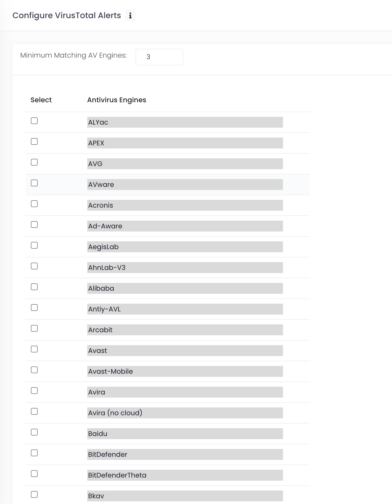
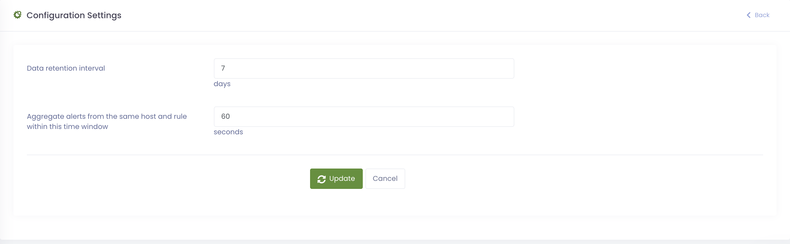
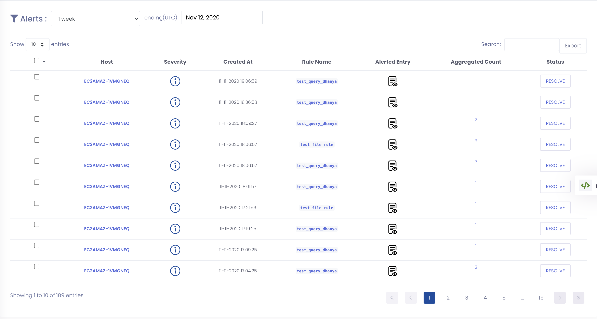
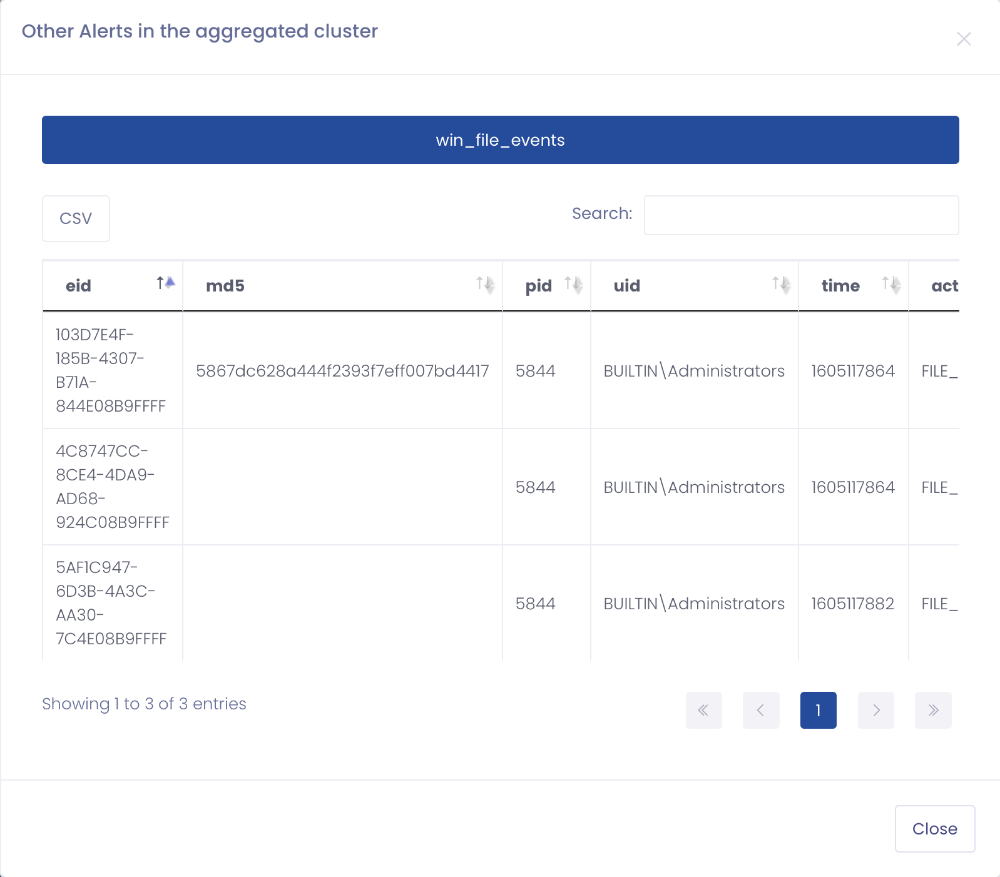

Configuring the PolyLogyx Server
================================================

After the PolyLogyx server is provisioned, the default and seeded configuration comes into play. If needed, you can customize the various configuration settings defined for the PolyLogyx server. 

To customize the configuration settings, you can modify the following:

1. VT Configuration 
2. Alert aggregation
3. Data Retention

Configuring VT  matching
--------------------------------
PolyLogyx ESP matches the file hashes collected with VirusTotal database, which is turn is collection of databased from multiple anti virus (AV) engines. ESP allows you to configure the matching so that the users can select then combination, count or both to be matched before an alert is triggered. This matching can be configured with 2 variables as shown below:

1. Minimum matching count : It provides the minimum number of AV engines to provide a positive match on file hash.
2. Selecting AV engines: It provides the list of AV engines selected by the user.

An alert is generated when either the minimum match count is hit or at least one of the selected engines yield a positive match.

  

Alert aggregation
---------------
PolyLogyx ESP provides allows for configuring rules for alerting. The rule engine is designed to express potentially suspicious or malicious behavior. However there is a possibility of a rule being triggered under benign activity and in a way that the same rule is being triggered multiple times. ESP aggregates (or De-Duplicates) all such alerts originating as a result of the same rule being hit multiple times from the same endpoint up to the time window interval specified in this setting (in seconds)
  

1. Click on `Alerts` to see the alerts
  

2. Click on Aggregated Count to list all the alerting events

  
  
Data Retention
---------------

PolyLogyx ESP can auto purge the data beyond the specified data retention interval. ESP auto purge the alerts, scheduled query events, status logs and removed hosts.
  

|										|																							|
|:---									|													   								    ---:|
|[Previous << Provisioning the PolyLogyx Client](../03_Provisioning_Polylogyx_Client/Readme.md)  | [Next >> Configuring the agent](../05_PolyLogyx_Client_Configurations/Readme.md)|
