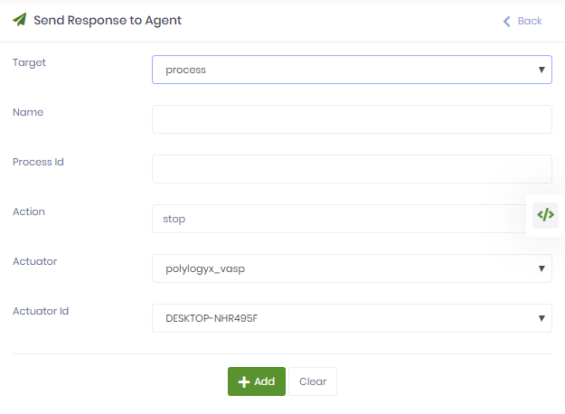
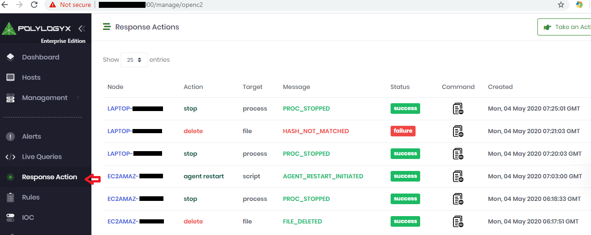

Response Actions
=================================== 

```diff
! Only available in the Enterprise Edition of the PolyLogyx ESP. !
```


PolyLogyx platform provides the security administrator abilities to take certain controlled actions in response to the detection of an intrusion, or attempt of one. These actions can allow the admininstrator to:

a) Delete a file from the endpoint

b) Terminate a process on the endpoint

c) Push a host firewall rule on the endpoint for containment, or limit, the network access (Available on Windows endpoints only)

d) Custom Action (Execute powershell/batch/shell scripts) on the endpoint


Perform these steps to take a response.
1. Access the web interface for the server.
2. Navigate to SOC Operations > Response. 

   
3. Click Add Response. The Send Response to Agent page is displayed. 
   On thid page, you can delete a file, terminate a process, or isolate an endpoint from the network.
   
   1. To delete a file, set the Target value to file, specify the full file name in the input text box, with the optional MD5 hash of the file, and the target endpoint.
   
   
   
   2. To terminate a process, set the Target value to process, specify the PID (process ID) and target endpoint.
   
   
   
   3. To isolate an endpoint using Windows Host Firewall interface, set the Target value to network and specify the other values. For details on the other values, see this [page](https://docs.microsoft.com/en-us/previous-versions/windows/it-pro/windows-server-2008-R2-and-2008/cc722141(v=ws.10)).
   
   
   
   4. To execute custom script, upload the script content or script file, select script type and target endpoint.
   
 4. Click Add to apply the changes.
 
    The response is created and listed on the Reponses page. 
 5. Review the response status to verify if the corresponding action was taken.  
 
    

 |										|																							|
|:---									|													   								    ---:|
|[Previous << Carves](../09_Carves/Readme.md)  | [Next >> Tables](../11_Tables/Readme.md)|
